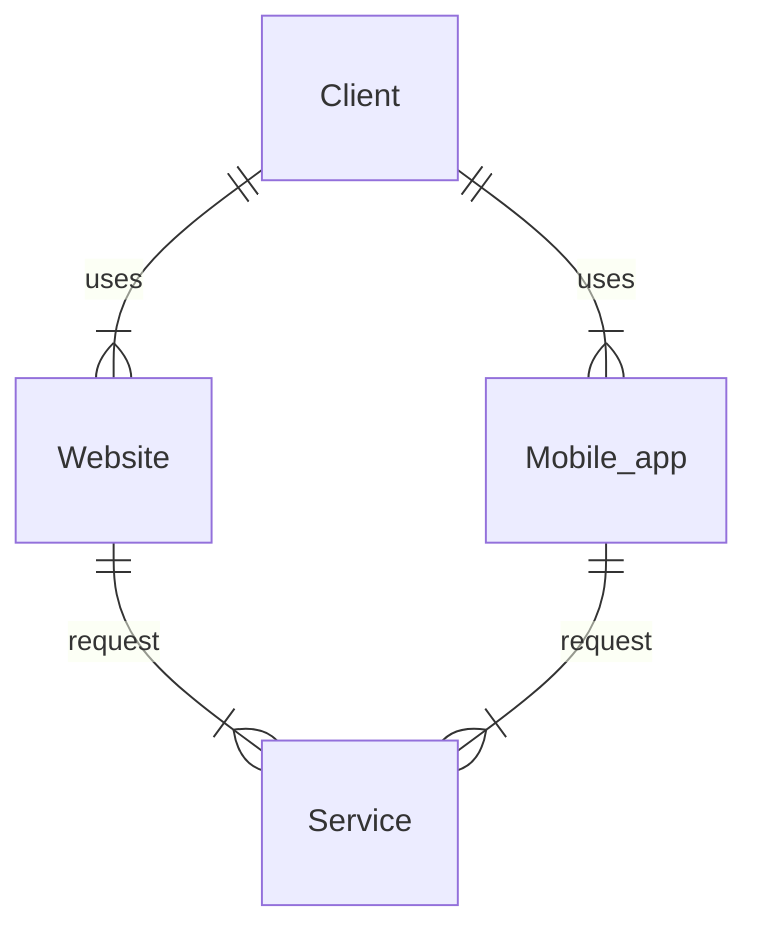
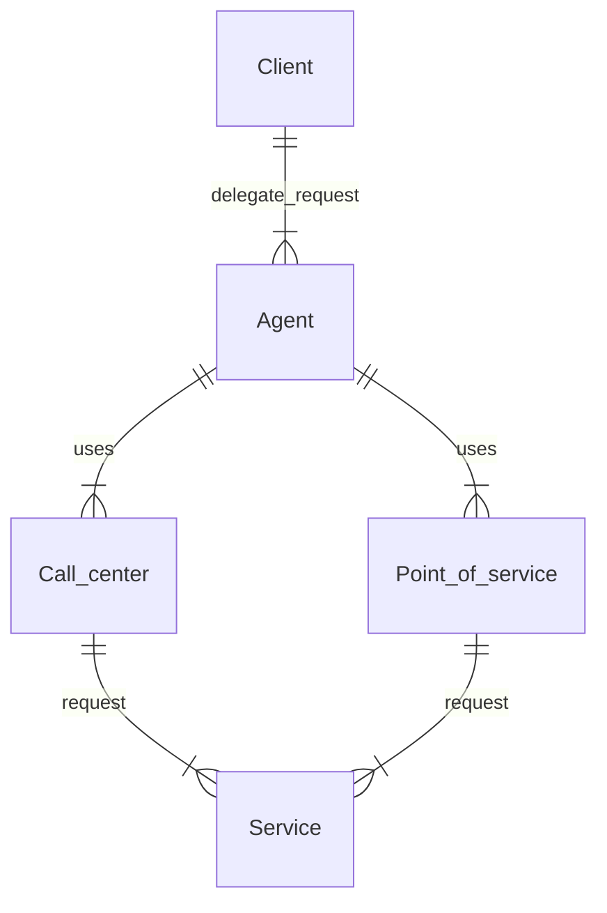
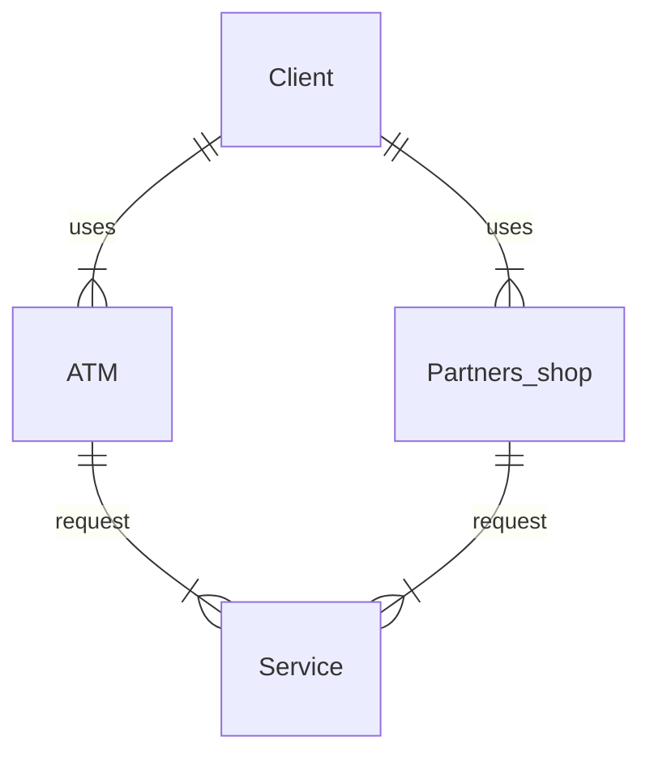
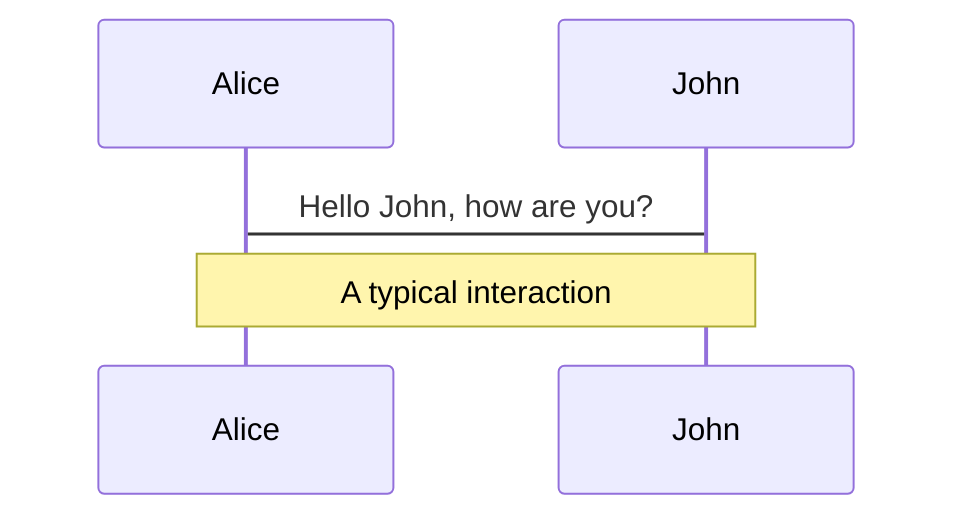
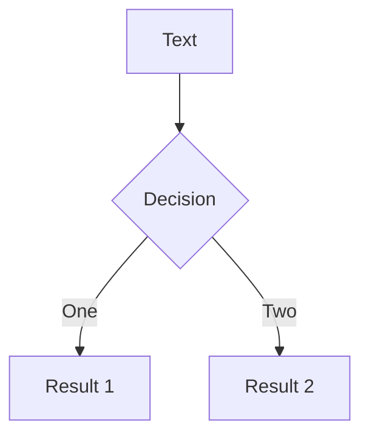
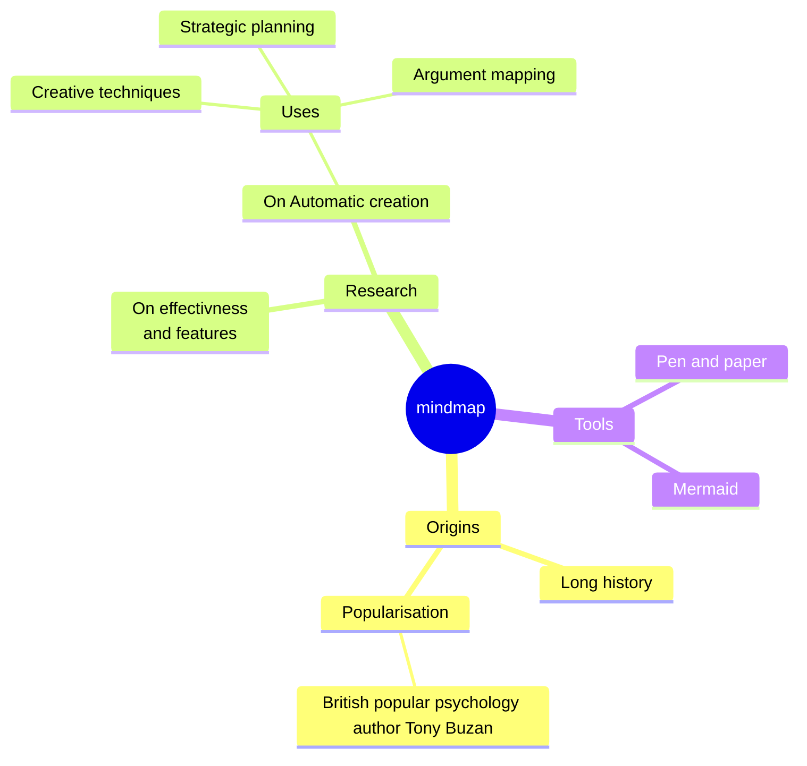
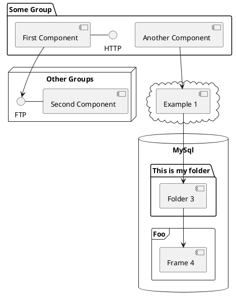

# Канальная архитектура

<div>Организация, Проблемы, Решения</div>


<div class="abs-br m-6 flex gap-2">
  <a href="https://github.com/slidevjs/slidev" target="_blank" alt="GitHub" title="Open in GitHub"
    class="text-xl slidev-icon-btn opacity-50 !border-none !hover:text-white">
    <carbon-logo-github />
  </a>
</div>

<!--
Комментарии к слайду:

Слайд приветствие, анонс темы митапа
-->

---
transition: fade-out
---

# Темы для обсуждения

- 📝 **Каналы** - классификация каналов сервисного обслуживания
- 🎯 **Проблемы** - проблемы канальной архитектуры
- 🧑‍💻 **Классическая канальная архитектура** - составные части архитектуры
- 🚧 **Инфраструктура** - связанные с канальной архитектурой инфраструктурные компоненты
- 🚦 **Пользовательский доступ** - доступ к сервису, предоставляемой услуге
- 🎥 **Пользовательская сессия** - управление пользовательской сессией
- 🚲 **Организация API** - принципы, рекомендации и паттерны
- 📤 **Backend For Frontend** - роль BFF в канальной архитектуре
- 🛠 **API Gateway** - когда необходимо использовать паттерн

<style>
h1 {
  background-color: #2B90B6;
  background-image: linear-gradient(45deg, #4EC5D4 10%, #146b8c 20%);
  background-size: 100%;
  -webkit-background-clip: text;
  -moz-background-clip: text;
  -webkit-text-fill-color: transparent;
  -moz-text-fill-color: transparent;
}
</style>

<!--
Комментарии к слайду:
Перечисление тем для обсуждения +тезисно о чем будет идти речь
Каналы - что такое каналы в контексте архитектуры,какие каналы бывают
Проблемы - проблемы типа множественных запросов к различным сервисам в рамка одной задачи,агрегирования запросов, интеграции с сервисами и тд
Классическая канальная архитектура - что из себя представляет канальная архитектура с различных точек зрения, примеры с диаграммами
Инфраструктура - различные инфраструктурные сервисы (сервисы, как правило предоставляемые облачной инфрой) связанные с канальной архитектурой
Пользовательский доступ - Пользователи и клиенты, в контексте канальной архитектуры, доступ к сервисам
Пользовательская сессия - Управление сессией, компоненты для реализации
Организация API - принципы построения апи в контексте канальной архитектуры
Backend For Frontend - паттерн BFF как часть канальной архитектуры
API Gateway - роль api gateway-я в канальной архитектуре и почему от него крайне плохо отказываться
-->

---
layout: image-right
image: https://img.freepik.com/free-vector/scan-me-qr-code_78370-2915.jpg?w=1480&t=st=1705516257~exp=1705516857~hmac=136818dc9d9054ad1295d3ddf4295778e45c3e4eed619476f9831cc70abf0171
---

# Содержание

<Toc maxDepth="1"></Toc>

<!-- 
Комментарии к слайду:
Слайд с содержанием и qr-code ссылкой на презентацию
-->

---
transition: slide-up
level: 1
---

# Каналы

<div>
«Канал обслуживания клиентов» — это способ предложить/предоставить и организовать обслуживание <u>клиента.</u>
</div>

<br>

## Типы каналов

|     |     |
| --- | --- |
| Самообслуживание | веб, мобильное приложение |
| Агенты | колл-центр, точки интереса |
| Партнеры | ATM, 3-rd party shops |

---
transition: slide-left
layout: image-right
image: https://www.commbox.io/wp-content/uploads/2019/10/52-1-1024x600.jpg
level: 2
---

# Самообслуживание



---
transition: slide-left
layout: image-right
image: https://images.ctfassets.net/3viuren4us1n/9JeAYuib2oE0QQYawCaqg/c857c8899b9461528089c297b30ec06d/empowering-agents.jpg
level: 2
---

# Агенты



---
transition: slide-left
layout: image-right
image: https://www.thoughtco.com/thmb/nW1rRXA8oe3PzL6WVLrz2NGTgh8=/1500x0/filters:no_upscale():max_bytes(150000):strip_icc()/thailand-atm-money-56a378765f9b58b7d0d21946.jpg
level: 2
---

# Партнеры



---
transition: slide-up
level: 2
---

# Процесс предоставления услуги


---
transition: slide-left
layout: image-right
image: https://img.freepik.com/premium-vector/group-people-speech-bubbles-comunication-illustration-chat-participants-ask-questions-find-music-discuss-various-topics_121223-1206.jpg
level: 2
---

# Процесс предоставления услуги

<br>

## Участники процесса

|     |     |
| --- | --- |
| Клиенты | некто использующий сервис |
| Сервисы | нечто реализующее услугу |
| Каналы | способ предоставить услугу |

---
transition: slide-left
layout: image-right
image: https://www.detrack.com/wp-content/uploads/2022/08/retail-delivery-service-scaled.jpg
level: 2
---

# Процесс предоставления услуги

<br>

## Процедура и активности

|     |     |
| --- | --- |
| Клиент | ищет и выбирает сервис через канал обслуживания |
| Сервис | доставка услуги через выбранный канал |
| Провайдер | выполняет все внутреннии процедуры для услуги |

---
transition: slide-up
layout: image-right
image: https://upload.wikimedia.org/wikipedia/commons/3/3b/Windows_9X_BSOD.png
---

# Проблемы

- 📝 **Уязвимость канала** - защищенность канала услуг от внешнего воздействия
- 🎯 **Безопасность сервиса** - зависимость работы сервиса от канала услуг
- 🧑‍💻 **Приватность клиента** - предотвращение утечки персональных данных

---
transition: slide-left
level: 2
---

# Уязвимость канала

<br>

## Сценарий - денежный перевод

<br>

- 📝 **Клиент** - использует услугу перевода денег
- 🎯 **Сервис** - состоит из "fiat" системы, крипто кошелька, системы клиентского оповещения
- 🧑‍💻 **Процедура** - мобильное приложение пошагово использует сервисы для перевода денег

---
transition: slide-left
level: 2
---

# Сценарий - денежный перевод (плохой)
Пошаговое и прямое использование API сервисов


---
transition: slide-left
level: 2
---

# Сценарий - денежный перевод (плохой)

<br>

- 📝 **Бизнес логика внутри канального мобильного приложения**
- 🎯 **Завершенные шаги не сохраняются**
- 🧑‍💻 **Множественные сетевые запросы**
- 🧑‍💻 **Сложная обработка ошибок**


---
transition: slide-left
level: 2
---

# Сценарий - денежный перевод (хороший)
Один запрос для услуги через сервисный агрегатор


---
transition: slide-left
level: 2
---

# Сценарий - денежный перевод (хороший)

<br>

- 📝 **Бизнес логика внутри service aggregator-а может быть переиспользована**
- 🎯 **Сохранение завершенных шагов**
- 🧑‍💻 **Множественные сетевые запросы эффективно обрабатываются в приватной сети**
- 🧑‍💻 **Обработка ошибок в одном месте**

---
transition: slide-left
level: 2
---

# Безопасность и приватность

<br>

## Сценарий - API для бухгалтерского учета

<br>

- 📝 **Клиент** - использует услугу по получению финансовой информации аккаунта
- 🎯 **Сервис** - предоставляет все данные в открытом виде
- 🧑‍💻 **Процедура** - фильтрация личных данных в канальном приложении

---
transition: slide-left
level: 2
---

# Сценарий - API для бухгалтерского учета (плохой)
Работа с персональными и важными данными напрямую в канальном приложении


---
transition: slide-left
level: 2
---

# Сценарий - API для бухгалтерского учета (плохой)

<br>

- 📝 **Бизнес логика внутри канального приложения**
- 🎯 **Уязвимость личных данных**

---
transition: slide-left
level: 2
---

# Сценарий - API для бухгалтерского учета (хороший)
Работа с персональными и важными данными делегированна сервису


---
transition: slide-left
level: 2
---

# Сценарий - API для бухгалтерского учета (хороший)

<br>

- 📝 **Бизнес логика фильтрации в сервисном слое**
- 🎯 **Личные данные скрыты**

---
transition: slide-up
---

# Классическая канальная архитектура

- 📝 **Канальная архитектура** - границы и компоненты
- 🎯 **Каналы** - определение и примеры
- 🧑‍💻 **Клиенты** - определение и связь с пользователем
- 🚦 **Провайдеры** - определение и связь с сервисом
- 🎥 **Сервисы** - определение и примеры

---
transition: slide-left
level: 2
---

# Канальная архитектура - границы и компоненты


---
transition: slide-left
level: 2
---

# Канальная архитектура - границы и компоненты


---
transition: slide-left
level: 2
---

# Границы канальной архитектуры

- 📝 **Пользовательский интерфейс** - Точка входа, для предоставления услуги, приложение или веб-сайт
- 🎯 **Сервисный слой** - Сервисы для инкапсуляции пользовательского доступа, интеграций
- 🧑‍💻 **Фасад / Service aggregator** - Композиция запросов, интерфейс для канального приложения

---
transition: slide-left
level: 2
---

# Каналы

- 📝 **Канал** - это способ предложить/предоставить и организовать обслуживание <u>клиента.</u>
- 🎯 **Канал обслуживания** - точка входа для предосталения и распространения услуги
- 🧑‍💻 **Множество каналов** - для покрытия большего числа клиентов

---
transition: slide-left
level: 2
---

# Каналы


---
transition: slide-left
level: 2
---

# Клиенты

- 📝 **Клиент** - это лицо или организация использующая сервис
- 🎯 **Клиент как программа** - иногда под клиентом подразумевается браузер, приложение
- 🧑‍💻 **Пользователь** - в программе, клиент может быть представлен в виде структуры данных

---
transition: slide-left
level: 2
---

# Клиенты


---
transition: slide-left
level: 2
---

# Провайдеры

- 📝 **Провайдер услуги** - это сущность предоставляющая сервис, например другому сервису
- 🎯 **Провайдер и сервис** - отношения между провайдером и сервисом регулируются SLA
- 🧑‍💻 **Внутреннии и внешние** - внутреннии, как база данных, внешник - отдельные сервисы со своим API

---
transition: slide-left
level: 2
---

# Провайдеры


---
transition: slide-left
level: 2
---

# Сервисы

- 📝 **Сервис** - нечто реализующее услугу
- 🎯 **Функции** - различные функции сервиса могут быть реализованы без использования провайдера
- 🧑‍💻 **Делегирование** - различный функции делегируются другим сервисам для упрощения

---
transition: slide-left
level: 2
---

# Сервисы


<!--
Presenter note with **bold**, *italic*, and ~~striked~~ text.

Also, HTML elements are valid:
<div class="flex w-full">
  <span style="flex-grow: 1;">Left content</span>
  <span>Right content</span>
</div>
-->

---
class: px-20
---

# Инфраструктура

не готово

---
preload: false
---

# Пользовательский доступ

Animations are powered by [@vueuse/motion](https://motion.vueuse.org/).

```html
<div
  v-motion
  :initial="{ x: -80 }"
  :enter="{ x: 0 }">
  Slidev
</div>
```

<div class="w-60 relative mt-6">
  <div class="relative w-40 h-40">
    
    
    
  </div>

  <div
    class="text-5xl absolute top-14 left-40 text-[#2B90B6] -z-1"
    v-motion
    :initial="{ x: -80, opacity: 0}"
    :enter="{ x: 0, opacity: 1, transition: { delay: 2000, duration: 1000 } }">
    Slidev
  </div>
</div>

<!-- vue script setup scripts can be directly used in markdown, and will only affects current page -->
<script setup lang="ts">
const final = {
  x: 0,
  y: 0,
  rotate: 0,
  scale: 1,
  transition: {
    type: 'spring',
    damping: 10,
    stiffness: 20,
    mass: 2
  }
}
</script>

<div
  v-motion
  :initial="{ x:35, y: 40, opacity: 0}"
  :enter="{ y: 0, opacity: 1, transition: { delay: 3500 } }">

[Learn More](https://sli.dev/guide/animations.html#motion)

</div>

---

# Пользовательская сессия

LaTeX is supported out-of-box powered by [KaTeX](https://katex.org/).

<br>

Inline $\sqrt{3x-1}+(1+x)^2$

Block
$$ {1|3|all}
\begin{array}{c}

\nabla \times \vec{\mathbf{B}} -\, \frac1c\, \frac{\partial\vec{\mathbf{E}}}{\partial t} &
= \frac{4\pi}{c}\vec{\mathbf{j}}    \nabla \cdot \vec{\mathbf{E}} & = 4 \pi \rho \\

\nabla \times \vec{\mathbf{E}}\, +\, \frac1c\, \frac{\partial\vec{\mathbf{B}}}{\partial t} & = \vec{\mathbf{0}} \\

\nabla \cdot \vec{\mathbf{B}} & = 0

\end{array}
$$

<br>

[Learn more](https://sli.dev/guide/syntax#latex)

---

# Организация API

You can create diagrams / graphs from textual descriptions, directly in your Markdown.

<div class="grid grid-cols-4 gap-5 pt-4 -mb-6">









</div>

[Learn More](https://sli.dev/guide/syntax.html#diagrams)

---
layout: center
class: text-center
---

# Backend For Frontend

[Documentations](https://sli.dev) · [GitHub](https://github.com/slidevjs/slidev) · [Showcases](https://sli.dev/showcases.html)

---
layout: center
class: text-center
---

# API Gateway

[Documentations](https://sli.dev) · [GitHub](https://github.com/slidevjs/slidev) · [Showcases](https://sli.dev/showcases.html)
