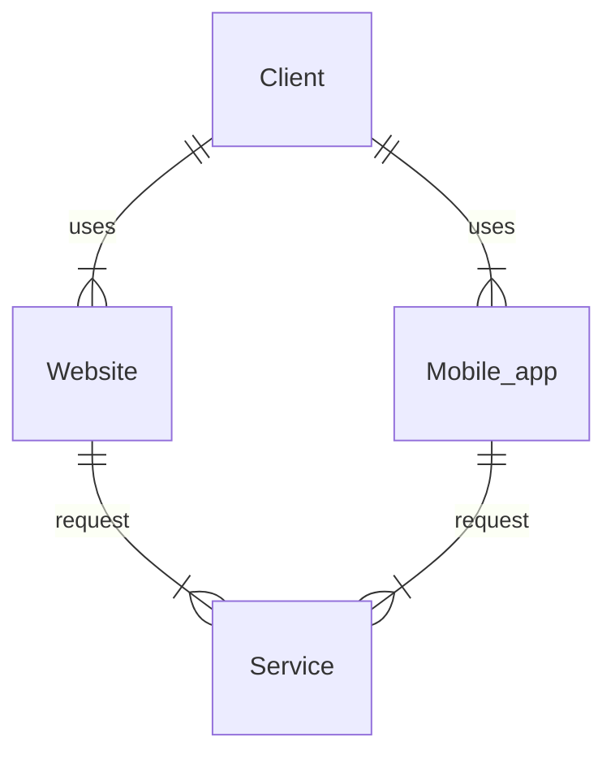
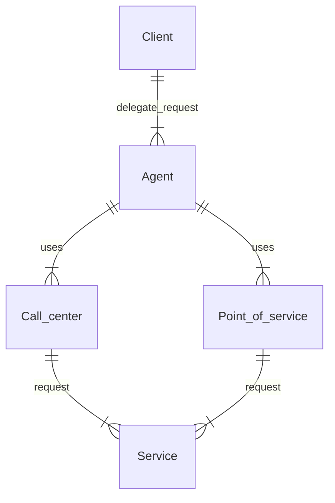
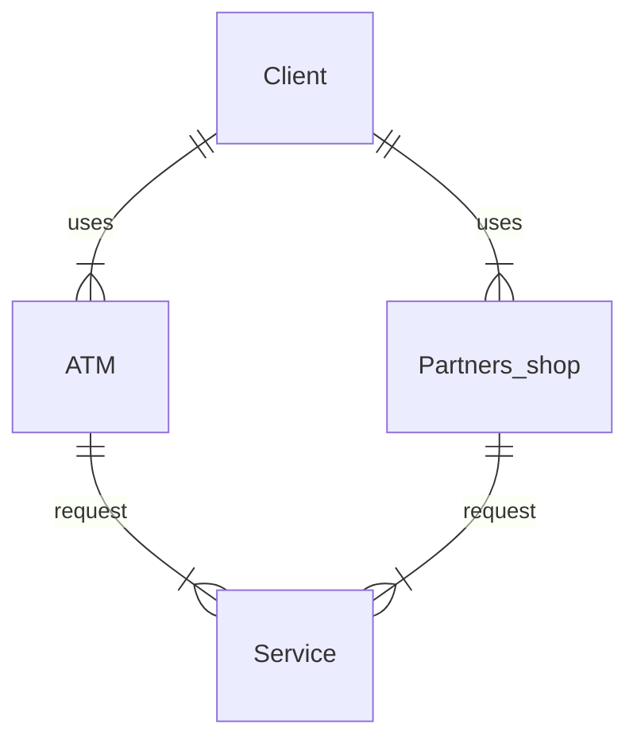
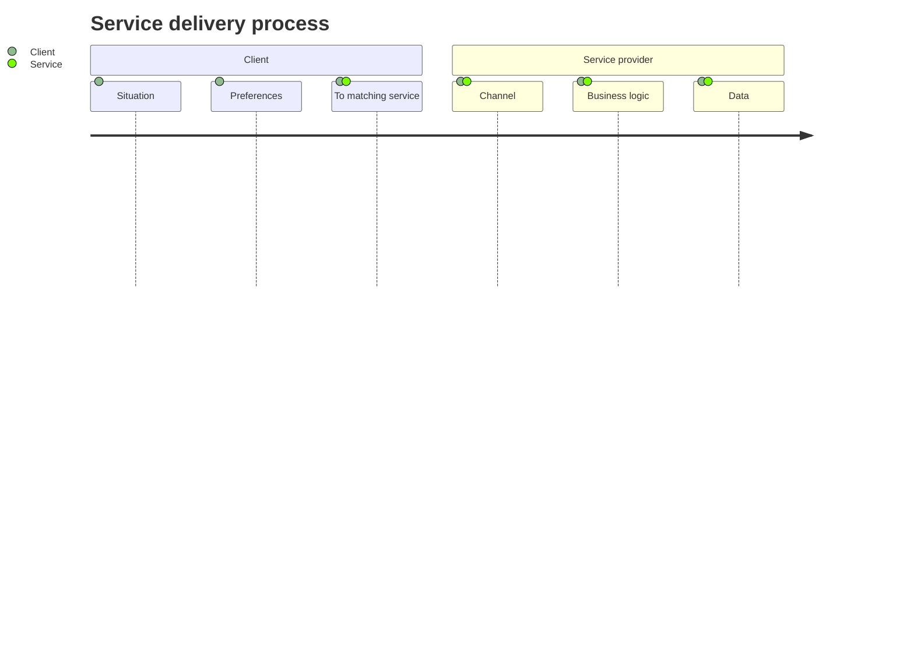

# Канальная архитектура

Организация, Проблемы, Решения

  <a href="https://github.com/skhrolenok/channel_architecture" target="_blank" alt="GitHub" title="Open in GitHub"
    class="text-xl slidev-icon-btn opacity-50 !border-none !hover:text-white">
    <carbon-logo-github />
  </a>

<!--
Комментарии к слайду:

Слайд приветствие, анонс темы митапа
-->

---
transition: fade-out
---

# Темы для обсуждения

- 📝 **Каналы** - классификация каналов сервисного обслуживания
- 🎯 **Проблемы** - проблемы канальной архитектуры
- 🧑‍💻 **Классическая канальная архитектура** - составные части архитектуры
- 🚧 **Инфраструктура** - связанные с канальной архитектурой инфраструктурные компоненты
- 🚦 **Пользовательский доступ** - доступ к сервису, предоставляемой услуге
- 🎥 **Пользовательская сессия** - управление пользовательской сессией
- 🚲 **Организация API** - принципы, рекомендации и паттерны
- 📤 **Backend For Frontend** - роль BFF в канальной архитектуре
- 🛠 **API Gateway** - когда необходимо использовать паттерн

<!--
Комментарии к слайду:
Перечисление тем для обсуждения +тезисно о чем будет идти речь
Каналы - что такое каналы в контексте архитектуры, какие каналы бывают
Проблемы - проблемы типа множественных запросов к различным сервисам в рамка одной задачи,агрегирования запросов, интеграции с сервисами и тд
Классическая канальная архитектура - что из себя представляет канальная архитектура с различных точек зрения, примеры с диаграммами
Инфраструктура - различные инфраструктурные сервисы (сервисы, как правило предоставляемые облачной инфрой) связанные с канальной архитектурой
Пользовательский доступ - Пользователи и клиенты, в контексте канальной архитектуры, доступ к сервисам
Пользовательская сессия - Управление сессией, компоненты для реализации
Организация API - принципы построения апи в контексте канальной архитектуры
Backend For Frontend - паттерн BFF как часть канальной архитектуры
API Gateway - роль api gateway-я в канальной архитектуре и почему от него крайне плохо отказываться
-->

---
layout: image-right
image: qr_code.png
level: 2
---

# Содержание

<Toc maxDepth="1"></Toc>

<!-- 
Комментарии к слайду:
Слайд с содержанием и qr-code ссылкой на презентацию
-->

---
transition: slide-up
level: 1
preload: false
image: https://www.repsly.com/hubfs/Repsly%20Zg%20Files/General%20Images/Graph%20Elements/Distribution%20Channels/Channels%201B.png
layout: image-right
---

# Каналы

«<u>Канал</u> обслуживания клиентов» — это способ предложить, предоставить и организовать обслуживание <u>клиента</u>

 

«<u>Канальная архитектура</u>» - организация программной системы по обслуживанию <u>клиента</u>

 

<!-- Определение канала, связь с клиентом и чем является канальная архитектура 
Добавить слайд с разделением продукта (открыть депозиты, кредиты) и канала
-->

<!-- Определение канала, и чем является канальная архитектура - организацией программной системы, 
со всеми компонентами их свойствами, связями. Разделение каналов по типу участникам участвующим в обслуживании клиента
-->

---
transition: slide-up
level: 2
layout: center
---

# Канал ≠ Продукт

---
transition: slide-left
layout: image-right
image: https://www.digiwebart.com/wp-content/uploads/2018/12/Best-Killer-Product-Marketing-Ideas-to-Boost-Business.jpg
---

# Продукт

- 📝 **Банковские продукты** - Открытие депозитов/Оформление кредита
- 🎥 **Медиапродукты** - Стриминговые сервисы, цифровая дистрибуция (игры, аудио, фильмы)
- 🏨 **Туризм/Путешествия** - Аренда, отели, билеты (booking, airbnb)

---
transition: slide-up
level: 2
image: https://www.drip.com/hubfs/omnichannel_vs_multichannel-BLOG.png
layout: image-right
---

# Разделение каналов 

 

## Тип обслуживания

|     |     |
| --- | --- |
| Самообслуживание | веб, мобильное приложение |
| Агенты | колл-центр, точки интереса |
| Партнеры | ATM, 3-rd party shops |

---
transition: slide-left
layout: image-right
image: https://www.commbox.io/wp-content/uploads/2019/10/52-1-1024x600.jpg
level: 2
---

# Самообслуживание

Клиент обслуживает себя <u>самостоятельно</u> - покупка товара через интернет-магазин

<!-- Тип канала - самообслуживание, вероятно самый популярный с которым приходилось иметь дело с точки зрения разработки:
мобильные приложения, веб-сайты и тд, всё где клиент обслуживает себя сам самостоятельно - например покупка товара через интернет-магазин
-->

---
transition: slide-left
layout: image-right
image: https://images.ctfassets.net/3viuren4us1n/9JeAYuib2oE0QQYawCaqg/c857c8899b9461528089c297b30ec06d/empowering-agents.jpg
level: 2
---

# Агенты

Клиент делегирует запрос услуги <u>агенту</u>

<!-- Клиент делегирует запрос услуги агенту, а тот её выполняет
используя соответствующий сервис
-->

---
transition: slide-left
layout: image-right
image: https://www.thoughtco.com/thmb/nW1rRXA8oe3PzL6WVLrz2NGTgh8=/1500x0/filters:no_upscale():max_bytes(150000):strip_icc()/thailand-atm-money-56a378765f9b58b7d0d21946.jpg
level: 2
---

# Партнеры

Клиент пользуется сервисом <u>партнеров</u>

<!-- Клиент использует не целевой (конечный) сервис, а сервис партнёров, по какой-либо причине
партнерский сервис предоставляя услугу, использует в том числе и целевой сервис
 -->

---
transition: slide-up
level: 2
---

# Процесс предоставления услуги

Процедуры и шаги для предоставления <u>сервиса</u>

 

<!-- Процесс предоставления услуги состоит из нескольких шагов
начинаем с потребностей (хотелок) и вопросов клиента, его предпочтений
и 'приходим' к соответствующему сервису. 
Далее по каналу предоставляем услугу, выполняем бизнес логику и тд

Канал это только канал - а не продукт
 -->

---
transition: slide-left
layout: image-right
image: https://img.freepik.com/premium-vector/sets-people-talking-speaking-each-other-collection-chatting-men-women-with-speech-bubbles-isolated-white-background-colorful-vector-illustration-flat-cartoon-style_7545-316.jpg?w=1800
level: 2
---

# Процесс предоставления услуги

 

## Участники процесса

|     |     |
| --- | --- |
| Клиенты | используют сервис |
| Продуктовые Сервисы | реализуют услугу |
| Каналы | способ предоставить услугу |

<!-- С точки зрения участников в процессе участвуют клиенты - им нужна услуга
сервисы - они услугу реализуют и каналы - они услугу предоставляют, точка входа в сервис
(еще есть сервис провайдер - это больше внутренности организации сервиса)
-->

---
transition: slide-up
layout: image-right
image: https://media0.giphy.com/media/mq5y2jHRCAqMo/giphy.gif?cid=6c09b95236ohii9vhopbvrwgfp74eh1910yhigmmvrlszjx2&ep=v1_gifs_search&rid=giphy.gif&ct=g
---

# Проблемы канальной архитектуры

- 📝 **Уязвимость канала** - защищенность канала услуг от внешнего воздействия
- 🎯 **Уязвимость сервиса** - зависимость работы сервиса от канала услуг. <U>Канал уязвим</u>, сервисы, доступные через канал, находятся под угрозой
- 🧑‍💻 **Приватность клиента** - предотвращение утечки персональных данных

<!-- В таком процессе неизбежны проблемы и сложности
связанные с уязвимостью канала так как он расчитан на внешнее воздействие
Работа самого сервиса с учетом различных уязвимостей и факторов
Приватность данных клиента при работе сервиса и предоставлению услуги
-->

---
transition: slide-left
layout: image-right
image: https://cdn.britannica.com/36/241736-159-D40F2AEC/Abstract-cryptocurrency-with-gold-bitcoin-background.jpg
level: 2
---

# Уязвимость канала

 

## Сценарий - денежный перевод

 

- 📝 **Клиент** - использует услугу перевода денег
- 🎯 **Сервис** - состоит из "fiat" системы, криптокошелька, системы клиентского оповещения
- 🧑‍💻 **Процедура** - мобильное приложение пошагово использует сервисы для перевода денег

<!-- Сценарий перевода денег -->

---
transition: slide-left
level: 2
---

# Сценарий - денежный перевод (плохой)

## Пошаговое и прямое использование API сервисов - канал "перегружен"

---
transition: slide-left
layout: image-right
image: https://holbornassets.com/wp-content/uploads/2022/12/crypto-crash-in-2022.jpg
level: 2
---

# Сценарий - денежный перевод (плохой)

 

- 📝 **Бизнес-логика внутри канального мобильного приложения**
- 🎯 **Завершенные шаги не сохраняются**
- 🧑‍💻 **Множественные сетевые запросы**
- 🚧 **Сложная обработка ошибок**

---
transition: slide-left
level: 2
---

# Сценарий - денежный перевод (хороший)

## Один запрос для композитной услуги через <u>сервис-агрегатор</u> канального уровня

---
transition: slide-left
layout: image-right
image: https://images.cointelegraph.com/cdn-cgi/image/format=auto,onerror=redirect,quality=90,width=1434/https://s3.cointelegraph.com/storage/uploads/view/45648641ad8264649327f585b3f49171.jpg
level: 2
---

# Сценарий - денежный перевод (хороший)

 

- 📝 **Бизнес-логика внутри "service aggregator"-а может быть переиспользована**
- 🎯 **Сохранение завершенных шагов**
- 🧑‍💻 **Множественные сетевые запросы эффективно обрабатываются в приватной сети**
- 🚧 **Обработка ошибок в одном месте**

---
transition: slide-left
layout: image-right
image: https://thumbor.forbes.com/thumbor/fit-in/900x510/https://www.forbes.com/advisor/wp-content/uploads/2023/01/Image-2-1.jpg
level: 2
---

# Безопасность и приватность

 

## Сценарий - API для бухгалтерского учета

 

- 📝 **Клиент** - использует услугу по получению финансовой информации аккаунта
- 🎯 **Сервис** - предоставляет все данные в открытом виде
- 🧑‍💻 **Процедура** - фильтрация личных данных в канальном приложении

---
transition: slide-left
level: 2
---

# Сценарий - API для бухгалтерского учета (плохой)

## Работа с персональными и важными данными <u>напрямую в канальном приложении</u>

---
transition: slide-left
image: https://www.shutterstock.com/image-photo/error-word-inscription-concept-failure-600nw-2276892643.jpg
layout: image-right
level: 2
---

# Сценарий - API для бухгалтерского учета (плохой)

 

- 📝 **Бизнес-логика внутри канального приложения**
- 🎯 **Уязвимость личных данных**

---
transition: slide-left
level: 2
---

# Сценарий - API для бухгалтерского учета (хороший)

## Работа с персональными и важными данными передана сервису

---
transition: slide-left
layout: image-right
image: https://st3.depositphotos.com/9116214/14524/i/450/depositphotos_145249981-stock-photo-business-statistics-success-concept-businessman.jpg
level: 2
---

# Сценарий - API для бухгалтерского учета (хороший)

 

- 📝 **Бизнес-логика фильтрации в сервисном слое канального уровня**
- 🎯 **Личные данные скрыты**

---
transition: slide-up
layout: image-right
image: https://i.pinimg.com/originals/de/9f/b4/de9fb48f2acab0edcb7b4ed287546ace.jpg
---

# Классическая канальная архитектура

- 📝 **Канальная архитектура** - границы и компоненты
- 🎯 **Каналы** - определение и примеры
- 🧑‍💻 **Клиенты** - определение и связь с пользователем
- 🚦 **Провайдеры** - определение и связь с сервисом
- 🎥 **Сервисы** - определение и примеры

---
transition: slide-left
level: 2
---

# Канальная архитектура - границы и компоненты

---
transition: slide-left
level: 2
---

# Канальная архитектура - границы и компоненты

---
transition: slide-left
layout: image-right
image: https://i.pinimg.com/736x/ff/de/7e/ffde7e5eef458531e25f3f685c28f359.jpg
level: 2
---

# Границы канальной архитектуры

- 📝 **Пользовательский интерфейс** - точка входа, для предоставления услуги, приложение или веб-сайт
- 🎯 **Сервисный слой канального уровня** - сервисы для инкапсуляции пользовательского доступа, интеграций. Это <u>не продуктовые сервисы</u>
- 🧑‍💻 **Фасад / Service aggregator** - композиция запросов, интерфейс для канального приложения

---
transition: slide-left
layout: image-right
image: https://pusher.com/docs/static/img/hero_howitworks.png
level: 2
---

# Каналы

- 📝 **Канал** - это способ предложить, предоставить и организовать обслуживание <u>клиента.</u>
- 🎯 **Канал обслуживания** - точка входа для предоставления и распространения услуги. Мобильное или десктоп приложение, вебсайт.
- 🧑‍💻 **Множество каналов** - для покрытия б**о**льшего числа клиентов

---
transition: slide-left
level: 2
---

# Каналы

---
transition: slide-left
layout: image-right
image: https://f.hellowork.com/blogdumoderateur/2023/09/relation-client-lexique.jpg
level: 2
---

# Клиенты

- 📝 **Клиент** - это лицо или организация, использующая сервис
- 🎯 **Клиент как программа** - иногда под клиентом подразумевается браузер, приложение
- 🧑‍💻 **Пользователь** - в программе клиент может быть представлен в виде структуры данных.

<!-- Клиент и пользователь это не одно и тоже!!!
сделать примеры (агентское - без пользователя, но с клиентом)
-->

---
transition: slide-left
level: 2
image: https://static.vecteezy.com/system/resources/previews/012/983/471/non_2x/people-talking-with-modern-robot-clients-or-users-communicate-with-humanoid-or-chatbot-get-help-support-ai-and-technology-concept-illustration-free-vector.jpg
layout: image-right
---

# Клиент ≠ Пользователь

- 📝 **Самообслуживание** - клиент <u>получает услугу</u> через канал, но для услуги через <u>канал самообслуживания</u> нужен пользователь
- 🎯 **Агенты** - клиент <u>получает услугу</u> через <u>канал агентов</u>, <u>пользователь есть у агента но не у клиента</u>

---
transition: slide-left
level: 2
---

# Клиенты

---
transition: slide-left
layout: image-right
image: https://img.freepik.com/premium-vector/positive-negative-line-icon-with-gears_116137-5854.jpg
level: 2
---

# Провайдеры aka Продуктовый/Доменный сервис

- 📝 **Провайдер услуги** - это сущность, предоставляющая сервис, например, другому сервису
- 🎯 **Провайдер и сервис** - отношения между провайдером и сервисом регулируются SLA
- 🧑‍💻 **Внутренние и внешние** - внутренние, как база данных, внешние - отдельные сервисы со своим API

---
transition: slide-left
level: 2
---

# Провайдеры

---
transition: slide-left
layout: image-right
image: https://sonatafy.com/wp-content/uploads/2023/05/Software-Development-Services-3.jpg
level: 2
---

# Сервисы

- 📝 **Сервис** - что-то, реализующее услугу
- 🎯 **Функции** - различные функции сервиса могут быть реализованы без использования провайдера
- 🧑‍💻 **Делегирование** - различные функции делегируются другим сервисам для упрощения

---
transition: slide-left
level: 2
---

# Сервисы

<!--
Presenter note with **bold**, *italic*, and ~~striked~~ text.

Also, HTML elements are valid:

  Left content
  Right content

-->

---
transition: slide-left
layout: image-right
image: https://learn.g2.com/hubfs/G2CM-FI108-Learn-Article-Images-%5BDCIM%5D_V1a.png
---

# Специфичные требования каналов к инфраструктуре

- 📝 **Контент** - пользователи каналов нуждаются в различном контенте
- 🧑‍💻 **Повторяющийся контент** - пользователи каналов часто запрашивают одни и те же данные
- 🎯 **Геолокация** - пользователи каналов могут находиться в разных местах
- 🚦 **Нагрузка** - пользователи по-разному нагружают канал и сервис
- 🚧 **Доступ** - управление и предоставления доступа канальным приложениям

---
transition: slide-left
layout: image-right
level: 2
image: https://patchmanager.com/wp-content/uploads/IoT-office-1200-x-628.png
---

# Инфраструктура

- 📝 **CDN** - доставка контента
- 🎯 **Кеш** - кеширование в "канальной архитектуре"
- 🧑‍💻 **Балансировщик нагрузки** - распределение входящего траффика

<!-- Инфраструктура и соответствующие сервисы в контексте
канальной архитектуры: CDN, Cache, Load Balancer-ы
Тема с API Gateway и BFF будет отдельно разобранна 

Спец требования к архитектуре
нужен контент
географ расположенность
клиенты запрашивают одни и те же данные
-->

---
transition: slide-left
layout: image-right
image: https://imagekit.io/blog/content/images/2020/06/cdn-blog-banner.jpg
level: 2
---

# CDN - Content Delivery Network

## Проблема <u>доставки контента</u>

 

- 📝 **Изображения**
- 🧑‍💻 **Видео**
- 🎯 **Ресурсы для веб страницы**

<!-- Какой контент доставляем - 
картинки, видео, ресурсы веб сайты типа .css, .js и т.д
-->

---
transition: slide-left
level: 2
---

# CDN - Content Delivery Network

## Проблема <u>доставки контента</u>

 

<!-- С помощью CDN доставка происходит быстрее - сервера локально ближе к клиенту -->

---
transition: slide-left
layout: image-right
image: https://encrypted-tbn0.gstatic.com/images?q=tbn:ANd9GcTvBhVx4ACXJRaVK9XA-kLfCWcb4YOoRNaYmw&usqp=CAU
level: 2
---

# Кеш

## Проблема <u>часто используемых</u> данных

 

- 📝 **Presentation Layer** - CDN, кеш браузера, пользовательский кеш
- 🧑‍💻 **Service Channel Layer** - кеширование запросов
- 🎯 **Domain Layer Caching*** - кеширование бд, сторонних сервисов

<!-- Кеш - быстрое хранилище данных, для быстрого доступа к часто используемым данным
Кеширование как паттерн/практика может быть применена почти к любой части системы/слою
-->

---
transition: slide-left
level: 2
---

# Кеш

## Проблема <u>часто используемых</u> данных

 

---
transition: slide-left
level: 2
---

# Кеш

## Проблема <u>часто используемых</u> данных

 

- 📝 **Client Side** - данные кешируются на стороне пользователя, например в браузере
- 🧑‍💻 **Server Side** - данные кешируются в компонентах обрабатывающих и создающих данные

 

---
transition: slide-left
image: https://img.freepik.com/premium-vector/browser-windows-vaporwave-style-80-90s-desktop-pc-with-pop-up-user-interface-elements_647843-176.jpg
layout: image-right
level: 2
---

# Presentation Layer Caching

## Проблема <u>часто используемых</u> данных

 

- 📝 **HTTP Caching** - кеширование HTTP запросов к ресурсам в браузере
- 🧑‍💻 **Cache API** - кеширование с помощью Cache API, ServiceWorker-ов
- 🎯 **Custom Local Cache** - кеш с пользовательским контролем данных и инвалидацией

---
transition: slide-left
level: 2
---

# HTTP Caching

---
transition: slide-left
level: 2
layout: image-right
image: https://media1.tenor.com/m/47CdzeuFFLIAAAAC/settings-machines.gif
---

# Cache API (For frontend)

---
transition: slide-left
level: 2
---

# Custom Local Cache

---
transition: slide-left
image: https://cdn.pressidium.com/wp-content/uploads/2017/05/Pressidium_blogpost_04_05_2017_Facebook.png
layout: image-right
level: 2
---

# Service Channel Layer Caching

## Проблема <u>часто используемых</u> данных

 

- 📝 **Request/Response Caching** - Кеширование на уровне инфраструктурных сервисов (nginx proxy cache, api gateway cache)
- 🧑‍💻 **Custom Application Caching*** - Пользовательское кеширование в рамках отдельного сервиса

---
transition: slide-left
layout: image-right
image: https://www.ovhcloud.com/sites/default/files/styles/large_screens_1x/public/2022-04/network-illustration_load-balancer.png
level: 2
---

# Балансировщик нагрузки

## Проблема <u>распределения нагрузки</u> входящего трафика

 

- 📝 **Точка входа** - балансировщик это точка входа для входящего трафика с клиента, клиентских приложений
- 🧑‍💻 **L4 Балансировщик** - оперирует на уровне L4 подключений
- 🎯 **L7 Балансировщик** - "умный" балансировщик с анализом типа трафика

<!-- Балансировщик - точка входа в апи для трафика приходящего 
с клиента и клиентского приложения
Бывают 2 типов - L4 на уровне адресов и L7 на уровне типа трафика, контента, кук и тд
-->

---
transition: slide-left
layout: image-right
image: https://media.licdn.com/dms/image/D4D12AQF1WsydWRR28g/article-cover_image-shrink_600_2000/0/1667051692815?e=2147483647&v=beta&t=yzA3kTHnMA4PNNEuNbVOwrLsdxHqrPnDOpoWXLTua38
level: 2
---

# Балансировщик нагрузки

## Проблема <u>распределения нагрузки</u> входящего трафика

 

- 📝 **Статические балансировщики** - распределение трафика без учета текущего состояния системы.
- 🧑‍💻 **Динамические балансировщики** - динамическое распределение трафика с учетом доступности и работоспособности сервера.

<!-- Статическая балансировка - без учета работы системы, годится только для первоначальной стадии
Динамическая - более сложная в настройке но учитывает работу системы и позволяет точную настройку
-->

---
transition: slide-left
level: 2
---

# Балансировщик нагрузки

## Проблема <u>распределения нагрузки</u> входящего трафика

<!-- Балансировщик - распределяет трафик по различным целям
бывает реализован в кач-ве устройства (hardware железка) так и програмным (nginx)
-->

---
transition: slide-left
level: 2
---

# Балансировщик нагрузки

## <u>Отсутствие</u> балансировки трафика

<!-- Отсутствие балансировки приводит к простоям 
одних серверов и перегруженности других
-->

---
transition: slide-left
level: 2
---

# Балансировщик нагрузки

## <u>Наличие</u> балансировки трафика

<!-- Наличие балансировки равномерно загружает сервера работой
-->

---
transition: slide-left
level: 2
---

# Балансировщик нагрузки и API Gateway

API Gateway может выполнять балансировку трафика или находится перед балансировщиком

<!-- API Gateway может в балансировку!
или находится перед балансировщиками (тогда возможно нет смысла использовать балансеры типа L7)
-->

---
transition: slide-left
level: 2
---

# Балансировщик нагрузки SaaS/PaaS

- 📝 **Amazon ELB**
- 🧑‍💻 **Azure LoadBalancer**
- 🎯 **GCP Cloud Load Balancing**

 

<!-- Сервисы балансировщики есть у облачных провайдеров
-->

---
transition: slide-left
level: 2
---

# Open-source software Load balancer

<!-- Kong - популярный api gateway с функциями балансера
-->

---
transition: slide-up
layout: image-right
image: https://img.freepik.com/free-vector/young-woman-checking-security-password-virsual-folder-isometric-illustration_1150-37274.jpg
---

# Пользовательский доступ

- 📝 **Аутентификации** - способы идентифицировать пользователя
- 🎯 **Привязка устройств** - дополнительная аутентификация
- 🧑‍💻 **Federated Identity** - контекст и решение

<!-- Темы, связанные с пользовательским доступом к сервисам -->

---
transition: slide-left
layout: image-right
level: 2
image: https://cdn-bpplm.nitrocdn.com/MJefRwORvlGzblepEIRIgrqQFCGliGiG/assets/static/optimized/rev-72f94ae/wp-content/uploads/2020/07/Website-Authentication_-The-Complete-Guide-with-FAQs.jpg
---

# Аутентификация

Большинству приложений требуется, чтобы пользователь каким-либо образом прошел аутентификацию, чтобы иметь доступ к данным, связанным с пользователем, или другому личному контенту.

 

Для обеспечения правильной обработки данных необходима процедура аутентификации.

---
transition: slide-left
level: 2
---

# Аутентификация и Авторизация

---
transition: slide-left
layout: image-right
image: https://discover.strongdm.com/hubfs/authentication-guide.png
level: 2
---

# Способы (Стратегии) аутентификации

- 📝 **Отдельно каждым сервисом** - каждый отдельный сервис реализует процедуру аутентификации
- 🎯 **Cервис Аутентификации** - отдельный сервис для аутентификации
- 🧑‍💻 **API Gateway** - централизация валидации аутентификации

---
transition: slide-left
level: 2
---

# Аутентификация внутри сервиса

<!-- Аутентификация внутри каждого сервиса, а в оригинале каждого микросервиса
достаточно проблематичная задачка, ведущая к дублированию логики аутентификации в каждом сервисе
Но зато сервисам не нужна отдельная аутентификация, но это того может не стоить -->

---
transition: slide-left
layout: image-right
image: https://securityintelligence.com/wp-content/uploads/2018/10/si-advanced-authentication-feature.jpg
level: 2
---

# Аутентификация внутри сервиса

- 📝 **Дублирование кода**
- 🎯 **Децентрализованая аутентификация**
- 🧑‍💻 **Автономность сервиса**

---
transition: slide-left
level: 2
---

# Cервис Аутентификации

<!-- Отдельно выделенный сервис аутентификации -->

---
transition: slide-left
layout: image-right
image: https://www.okta.com/sites/default/files/images/white-paper/inline/Identity-Services-diagram.png
level: 2
---

# Cервис Аутентификации

- 📝 **Использование token-based протокола аутентификации**
- 🎯 **Централизованная аутентификация**

---
transition: slide-left
level: 2
---

# API Gateway

<!-- API Gateway для валидации наличия аутентификации -->

---
transition: slide-left
layout: image-right
image: https://www.connecting-software.com/wp-content/uploads/2023/01/API-Gateway-Diagram.webp
level: 2
---

# API Gateway

- 📝 **Использование протокола аутентификации**
- 🎯 **Централизованная валидация наличия аутентификации**
- 🎯 **Централизованная обработка ошибок аутентификация**
- 🧑‍💻 **Результат передается в конечные сервисы** - для <u>дополнительной авторизации</u> при необходимости

---
transition: slide-left
layout: image-right
image: https://fully-verified.com/wp-content/uploads/2021/08/1.png.webp
level: 2
---

# Методы Аутентификации

- 📝 **HTTP Authentication** - базовая аутентикация основанная на HTTP authentication framework-е
- 🎯 **API Keys** - идентификаторы для доступа к отдельному ресурсу
- 🧑‍💻 **Token-based протоколы, OAuth 2.0** - аутентификация посредством предоставления токена

<!-- Речь не про методы аутентификации в общем, таких как как биометрия, пароль, сертификат и тд
а про методы представления факта аутентификации в цифровой системе и канальной архитектуре частности -->

---
transition: slide-left
level: 2
---

# HTTP Authentication

<!-- Аутентификация на основе http auth framework-а, где браузер понимает когда запрашивается аутентификация пользователя -->

---
transition: slide-left
level: 2
---

# API Keys

<!-- Аутентификация с помощью API ключей, где предоставленный ключ - идентифицирует пользователя, пример - google maps auth key -->

---
transition: slide-left
level: 2
---

# Token-based authentication

<!-- Аутентификация с помощью API ключей, где предоставленный ключ - идентифицирует пользователя, пример - google maps auth key -->

---
transition: slide-left
layout: image-right
image: https://www.1kosmos.com/wp-content/uploads/sim-binding-seo-ft.jpg
level: 2
---

# Привязка устройств

- 📝 **Дополнительная безопасность** - когда пароля и электронной почты недостаточно
- 🎯 **Финтех и банки** - наиболее распространенные случаи применения
- 🧑‍💻 **Использование внутренних IT услуг компании являясь сотрудником** - доступ к корпоративным ресурсам, не через VPN

---
transition: slide-left
level: 2
---

# Привязка устройств

<!-- Привязка устройств схема-->

---
transition: slide-left
level: 2
---

# Привязка устройств

- 📝 **Пользователь аутентифицирует себя через свой адрес электронной почты (или имя пользователя) и пароль.**
- 🎯 **Cистема берет идентификатор устройства через UIDevice и проверяет в удаленной базе данных, например Firebase, идентификатор устройства, зарегистрированный для идентификатора учетной записи.**
- 🧑‍💻 **Если к зарегистрированной учетной записи не подключено ни одно устройство, новое устройство регистрируется под этим идентификатором учетной записи**
- 🚧 **Если для этой учетной записи уже существует идентификатор устройства, идентификатор локального устройства следует сравнить с удаленно зарегистрированным**
- 🚦 **Если оба идентификатора равны, пользователь должен пройти аутентификацию**

<!-- Привязка устройств шаги-->

---
transition: slide-left
layout: image-right
image: https://www.10duke.com/wp-content/uploads/2020/05/ID-federation-600x337.png
level: 2
---

# Federated identity - (корпоративный доступ)

- 📝 **Плохой пользовательский опыт** - пользователи часто забывают учетные данные для входа, когда у них много разных аккаунтов
- 🎯 **Безопасность** - когда пользователь покидает компанию, его учетная запись должна быть немедленно удалена
- 🧑‍💻 **Управление пользователями** - администраторы вынуждены управлять учетными данными для всех пользователей

<!-- Пользователи привыкли использовать одни и те же креды для приложений -->

---
transition: slide-left
layout: image-right
image: https://www.aimtechnologies.co/wp-content/uploads/2023/09/customer-segmentation-social.png
level: 2
---

# Federated identity - (пользовательский опыт)

- 📝 **Спрятать сегментацию** - Пользователи хотят работать с разными продуктами одной компании как с единой услугой
- 🎯 **Регистрация - барьер** - пользователи воспринимают дополнительные регистрации как повод отказаться от услуги вообще

<!-- Пользователи привыкли использовать одни и те же креды для приложений -->

---
transition: slide-left
level: 2
---

# Federated identity

<!-- Привязка устройств схема-->

---
transition: slide-up
level: 2
image: https://www.agilicus.com/www/96b2b2c8-federated-users.svg
layout: image-right
---

# Federated identity - сценарии для применения

- 📝 **Единый вход в организации** - необходимо аутентифицировать сотрудников для корпоративных приложений, размещенных в облаке за пределами границ корпоративной сети
- 🎯 **Идентификация пользователей партнёров** - необходимо аутентифицировать как корпоративных сотрудников, так и деловых партнеров, у которых нет учетных записей в корпоративном каталоге.

---
transition: slide-up
layout: image-right
image: https://www.getfoundquick.com/wp-content/uploads/2019/01/average-session-time.jpg
---

# Пользовательская сессия

- 📝 **Определение сессии**
- 🎯 **Управление сессией внутри презентационного слоя**
- 🎯 **Управление сессией внутри бизнес слоя**

---
transition: slide-left
layout: image-right
image: https://d1nhio0ox7pgb.cloudfront.net/_img/v_collection_png/512x512/shadow/user_time.png
level: 2
---

# Пользовательская сессия

- 📝 **Сессия** - время, в течение которого посетитель пользуется сервисом, просматривает веб-сайт.
- 🎯 **Хранение сессии** - запросы пользователя последовательно обрабатываются одним и тем же сервером или узлом во время сеанса
- 🎯 **Пользовательский опыт** - если пользователь входит в веб-приложение, а затем его перенаправляют на другой сервер, он может потерять свой статус аутентификации, корзину покупок или свои предпочтения.

---
transition: slide-left
level: 2
---

# Отсутствие пользовательской сессии

---
transition: slide-left
level: 2
---

# Управление сессией внутри приложения

<!-- Фактически внутри презентационного слоя -->

---
transition: slide-left
level: 2
---

# Управление сессией внутри бизнес слоя

<!-- Фактически внутри презентационного слоя -->

---
transition: slide-up
layout: image-right
image: https://blog.postman.com/wp-content/uploads/2021/03/APIs-in-Postman-e1616786230943.png
---

# Организация API

- 📝 **От приложений до BFF/сервисов**
- 🎯 **От BFF к доменным срвисам**

---
transition: slide-left
level: 2
---

# От приложений до BFF/сервисов

---
transition: slide-left
level: 2
image: https://www.mabl.com/hubfs/blog%20assets/blog-post-leverage-ui-and-api-tests-for-early-performance-monitoring-09NOV2022.png#keepProtocol
layout: image-right
---

# От приложений до BFF/сервисов

- 📝 **Независимость от платформы** - Любой клиент должен иметь возможность вызывать API независимо от того, как API реализован внутри
- 🎯 **Эволюция сервиса** - API сервис должен иметь возможность развиваться и добавлять функциональные возможности независимо от клиентских приложений. По мере развития API существующие клиентские приложения должны продолжать работать без изменений

---
transition: slide-left
image: https://miro.medium.com/v2/resize:fit:1024/1*--Rf2v3QRKlaG3P7U_TmXA.jpeg
layout: image-right
level: 2
---

# От приложений до BFF/сервисов (паттерны)

- 📝 **Ambassador**
- 🎯 **Gatekeeper**
- 🚧 **Gateway aggregation**
- 🚦 **Gateway routing**

---
transition: slide-up
layout: image-right
image: https://hackernoon.imgix.net/images/g6d7uBnJu9SKvFzrtcQcdoIYCzW2-ntf3ljt.jpeg
---

# Backend For Frontend

- 📝 **Сервис на каждый интерфейс** - выделенный сервис для каждого канального приложения
- 🎯 **Оптимизация** - настройка API под нужды приложения

---
transition: slide-left
layout: image-right
image: https://miro.medium.com/v2/0*-w-dJlLlV0CR7qE_.png
level: 2
---

# Backend For Frontend - когда использовать

- 📝 **Сложность работы в core сервисе** - значительные расходы при работе и доработках в основном сервисе, монолите
- 🎯 **Требования интерфейсов** - существует необходимость оптимизировать сервер под конкретный интерфейс
- 🚦 **Технический стек** - язык программирования и тулинг продуктового слоя не всегда подходит для различных пользовательских интерфейсов

---
transition: slide-left
level: 2
---

# Backend For Frontend

---
transition: slide-left
level: 2
---

# Backend For Frontend

---
transition: slide-up
layout: image-right
image: https://www.cisco.com/c/dam/assets/swa/img/anchor-info/graphic-network-gateway-628x353.jpg
---

# API Gateway

- 📝 **Маршрутизация** - прокси (reverse-proxy) для перенаправления или маршрутизации запросов к конечным сервисам
- 🎯 **Композиция запросов** - объединения несколько клиентских запросов, предназначенных для нескольких сервисов, в один клиентский запрос
- 🚧 **Менеждмент API** - метрики и аналитика входящего трафика, троттлинг и управление доступом
- 🧑‍💻 **Cross-cutting concerns** - реализация задач аутентификации, обнаружения сервисов, кеширования, балансировки

---
transition: slide-left
level: 2
---

# API Gateway

---
transition: slide-left
level: 2
---

# API Gateway / BFF

---
transition: slide-left
layout: center
level: 2
---

# Спасибо за внимание