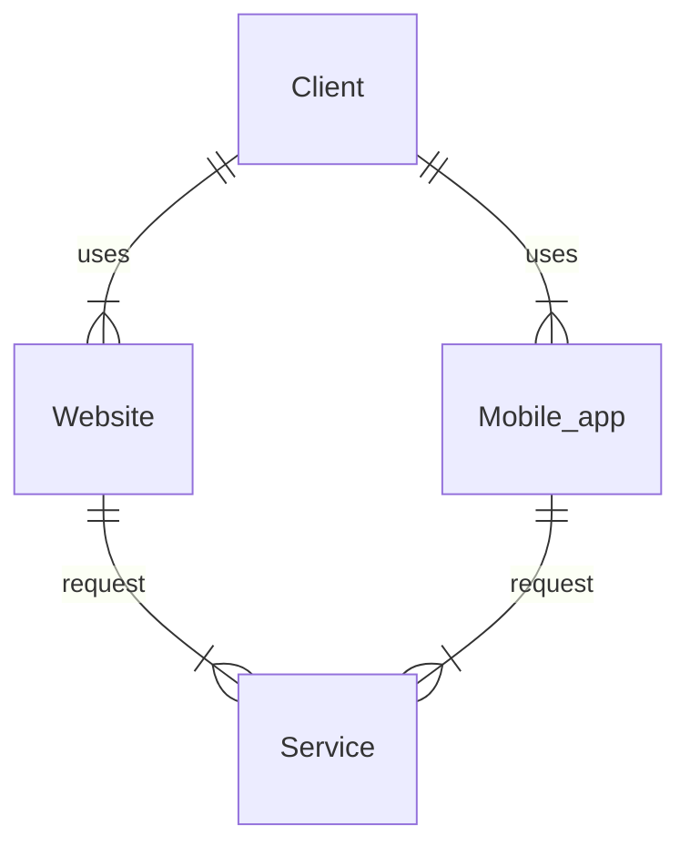
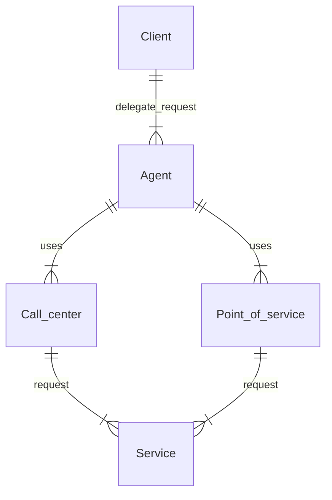
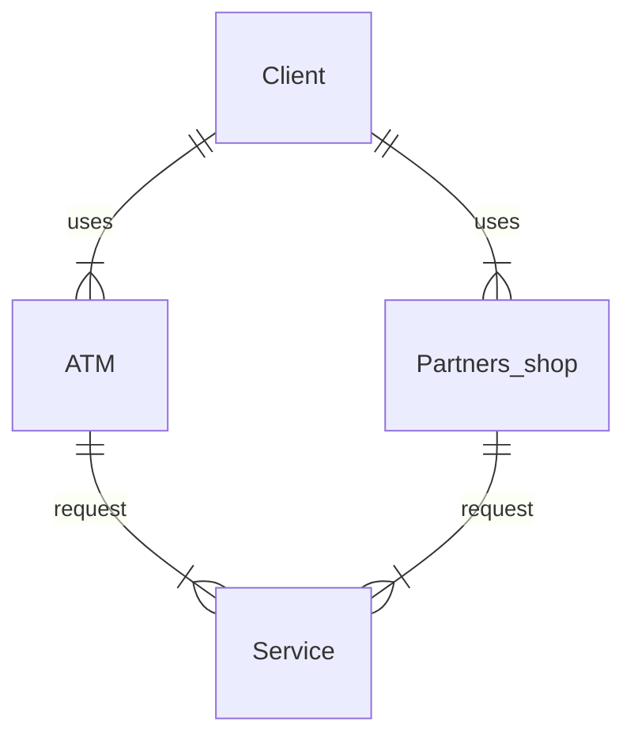
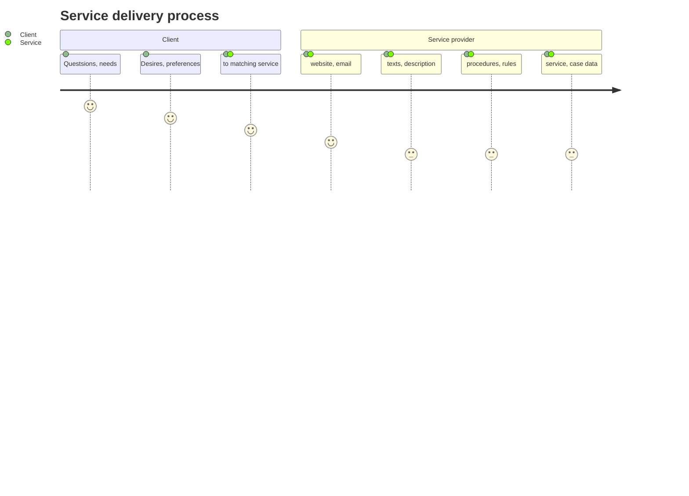

# Канальная архитектура

Организация, Проблемы, Решения

  <a href="https://github.com/slidevjs/slidev" target="_blank" alt="GitHub" title="Open in GitHub"
    class="text-xl slidev-icon-btn opacity-50 !border-none !hover:text-white">
    <carbon-logo-github />
  </a>

<!--
Комментарии к слайду:

Слайд приветствие, анонс темы митапа
-->

---
transition: fade-out
---

# Темы для обсуждения

- 📝 **Каналы** - классификация каналов сервисного обслуживания
- 🎯 **Проблемы** - проблемы канальной архитектуры
- 🧑‍💻 **Классическая канальная архитектура** - составные части архитектуры
- 🚧 **Инфраструктура** - связанные с канальной архитектурой инфраструктурные компоненты
- 🚦 **Пользовательский доступ** - доступ к сервису, предоставляемой услуге
- 🎥 **Пользовательская сессия** - управление пользовательской сессией
- 🚲 **Организация API** - принципы, рекомендации и паттерны
- 📤 **Backend For Frontend** - роль BFF в канальной архитектуре
- 🛠 **API Gateway** - когда необходимо использовать паттерн

<!--
Комментарии к слайду:
Перечисление тем для обсуждения +тезисно о чем будет идти речь
Каналы - что такое каналы в контексте архитектуры,какие каналы бывают
Проблемы - проблемы типа множественных запросов к различным сервисам в рамка одной задачи,агрегирования запросов, интеграции с сервисами и тд
Классическая канальная архитектура - что из себя представляет канальная архитектура с различных точек зрения, примеры с диаграммами
Инфраструктура - различные инфраструктурные сервисы (сервисы, как правило предоставляемые облачной инфрой) связанные с канальной архитектурой
Пользовательский доступ - Пользователи и клиенты, в контексте канальной архитектуры, доступ к сервисам
Пользовательская сессия - Управление сессией, компоненты для реализации
Организация API - принципы построения апи в контексте канальной архитектуры
Backend For Frontend - паттерн BFF как часть канальной архитектуры
API Gateway - роль api gateway-я в канальной архитектуре и почему от него крайне плохо отказываться
-->

---
layout: image-right
image: https://img.freepik.com/free-vector/scan-me-qr-code_78370-2915.jpg?w=1480&t=st=1705516257~exp=1705516857~hmac=136818dc9d9054ad1295d3ddf4295778e45c3e4eed619476f9831cc70abf0171
---

# Содержание

<Toc maxDepth="1"></Toc>

<!-- 
Комментарии к слайду:
Слайд с содержанием и qr-code ссылкой на презентацию
-->

---
transition: slide-up
level: 1
preload: false
---

# Каналы

«<u>Канал</u> обслуживания клиентов» — это способ предложить/предоставить и организовать обслуживание <u>клиента</u>

 

«<u>Канальная архитектура</u>» - организация программной системы по обслуживанию <u>клиента</u>

 

## Типы каналов

|     |     |
| --- | --- |
| Самообслуживание | веб, мобильное приложение |
| Агенты | колл-центр, точки интереса |
| Партнеры | ATM, 3-rd party shops |

<!-- Определение канала, и чем является канальная архитектура - организацией программной системы, 
со всеми компонентами их свойствами, связями. Разделение каналов по типу участникам участвующим в обслуживании клиента
-->

---
transition: slide-left
layout: image-right
image: https://www.commbox.io/wp-content/uploads/2019/10/52-1-1024x600.jpg
level: 2
---

# Самообслуживание

Клиент обслуживает себя сам самостоятельно - покупка товара через интернет-магазин

<!-- Тип канала - самообслуживание, вероятно самый популярный с которым приходилось иметь дело с точки зрения разработки:
мобильные приложения, веб-сайты и тд, всё где клиент обслуживает себя сам самостоятельно - например покупка товара через интернет-магазин
-->

---
transition: slide-left
layout: image-right
image: https://images.ctfassets.net/3viuren4us1n/9JeAYuib2oE0QQYawCaqg/c857c8899b9461528089c297b30ec06d/empowering-agents.jpg
level: 2
---

# Агенты

Клиент делегирует запрос услуги <u>агенту</u>

<!-- Клиент делегирует запрос услуги агенту, а тот её выполняет
используя соответствующий сервис
-->

---
transition: slide-left
layout: image-right
image: https://www.thoughtco.com/thmb/nW1rRXA8oe3PzL6WVLrz2NGTgh8=/1500x0/filters:no_upscale():max_bytes(150000):strip_icc()/thailand-atm-money-56a378765f9b58b7d0d21946.jpg
level: 2
---

# Партнеры

Клиент пользуется сервисом партнеров

<!-- Клиент использует не целевой (конечный) сервис, а сервис партнёров, по какой-либо причине
партнерский сервис предоставляя услугу, использует в том числе и целевой сервис
 -->

---
transition: slide-up
level: 2
---

# Процесс предоставления услуги

Процедуры и шаги для предоставления сервиса

 

<!-- Процесс предоставления услуги состоит из нескольких шагов
начинаем с потребностей (хотелок) и вопросов клиента, его предпочтений
и 'приходим' к соответствующему сервису. 
Далее по каналу предоставляем услугу, выполняем бизнес логику и тд
 -->

<!--  -->

---
transition: slide-left
layout: image-right
image: https://img.freepik.com/premium-vector/sets-people-talking-speaking-each-other-collection-chatting-men-women-with-speech-bubbles-isolated-white-background-colorful-vector-illustration-flat-cartoon-style_7545-316.jpg?w=1800
level: 2
---

# Процесс предоставления услуги

 

## Участники процесса

|     |     |
| --- | --- |
| Клиенты | используют сервис |
| Сервисы | реализуют услугу |
| Каналы | способ предоставить услугу |

<!-- С точки зрения участников в процессе участвуют клиенты - им нужна услуга
сервисы - они услугу реализуют и каналы - они услугу предоставляют, точка входа в сервис
(еще есть сервис провайдер - это больше внутренности организации сервиса)
-->

---
transition: slide-left
layout: image-right
image: https://www.detrack.com/wp-content/uploads/2022/08/retail-delivery-service-scaled.jpg
level: 2
---

# Процесс предоставления услуги

 

## Процедура и активности

|     |     |
| --- | --- |
| Клиент | ищет и выбирает сервис через канал обслуживания |
| Сервис | доставка услуги через выбранный канал |
| Провайдер | выполняет все внутреннии процедуры для услуги |

<!-- С точки зрения активности, 
клиент выбирает сервис, сервис предоставляет услугу через канал
а провайдер выполняет внутренние процессы
-->

---
transition: slide-up
layout: image-right
image: https://media0.giphy.com/media/mq5y2jHRCAqMo/giphy.gif?cid=6c09b95236ohii9vhopbvrwgfp74eh1910yhigmmvrlszjx2&ep=v1_gifs_search&rid=giphy.gif&ct=g
---

# Проблемы

- 📝 **Уязвимость канала** - защищенность канала услуг от внешнего воздействия
- 🎯 **Работоспособность сервиса** - зависимость работы сервиса от канала услуг
- 🧑‍💻 **Приватность клиента** - предотвращение утечки персональных данных

<!-- В таком процессе неизбежны проблемы и сложности
связанные с уязвимостью канала так как он расчитан на внешнее воздействие
Работа самого сервиса с учетом различных уязвимостей и факторов
Приватность данных клиента при работе сервиса и предоставлению услуги
-->

---
transition: slide-left
level: 2
---

# Уязвимость канала

 

## Сценарий - денежный перевод

 

- 📝 **Клиент** - использует услугу перевода денег
- 🎯 **Сервис** - состоит из "fiat" системы, крипто кошелька, системы клиентского оповещения
- 🧑‍💻 **Процедура** - мобильное приложение пошагово использует сервисы для перевода денег

---
transition: slide-left
level: 2
---

# Сценарий - денежный перевод (плохой)
Пошаговое и прямое использование API сервисов

---
transition: slide-left
level: 2
---

# Сценарий - денежный перевод (плохой)

 

- 📝 **Бизнес логика внутри канального мобильного приложения**
- 🎯 **Завершенные шаги не сохраняются**
- 🧑‍💻 **Множественные сетевые запросы**
- 🧑‍💻 **Сложная обработка ошибок**

---
transition: slide-left
level: 2
---

# Сценарий - денежный перевод (хороший)
Один запрос для услуги через сервисный агрегатор

---
transition: slide-left
level: 2
---

# Сценарий - денежный перевод (хороший)

 

- 📝 **Бизнес логика внутри service aggregator-а может быть переиспользована**
- 🎯 **Сохранение завершенных шагов**
- 🧑‍💻 **Множественные сетевые запросы эффективно обрабатываются в приватной сети**
- 🧑‍💻 **Обработка ошибок в одном месте**

---
transition: slide-left
level: 2
---

# Безопасность и приватность

 

## Сценарий - API для бухгалтерского учета

 

- 📝 **Клиент** - использует услугу по получению финансовой информации аккаунта
- 🎯 **Сервис** - предоставляет все данные в открытом виде
- 🧑‍💻 **Процедура** - фильтрация личных данных в канальном приложении

---
transition: slide-left
level: 2
---

# Сценарий - API для бухгалтерского учета (плохой)
Работа с персональными и важными данными напрямую в канальном приложении

---
transition: slide-left
level: 2
---

# Сценарий - API для бухгалтерского учета (плохой)

 

- 📝 **Бизнес логика внутри канального приложения**
- 🎯 **Уязвимость личных данных**

---
transition: slide-left
level: 2
---

# Сценарий - API для бухгалтерского учета (хороший)
Работа с персональными и важными данными делегированна сервису

---
transition: slide-left
level: 2
---

# Сценарий - API для бухгалтерского учета (хороший)

 

- 📝 **Бизнес логика фильтрации в сервисном слое**
- 🎯 **Личные данные скрыты**

---
transition: slide-up
---

# Классическая канальная архитектура

- 📝 **Канальная архитектура** - границы и компоненты
- 🎯 **Каналы** - определение и примеры
- 🧑‍💻 **Клиенты** - определение и связь с пользователем
- 🚦 **Провайдеры** - определение и связь с сервисом
- 🎥 **Сервисы** - определение и примеры

---
transition: slide-left
level: 2
---

# Канальная архитектура - границы и компоненты

---
transition: slide-left
level: 2
---

# Канальная архитектура - границы и компоненты

---
transition: slide-left
level: 2
---

# Границы канальной архитектуры

- 📝 **Пользовательский интерфейс** - Точка входа, для предоставления услуги, приложение или веб-сайт
- 🎯 **Сервисный слой** - Сервисы для инкапсуляции пользовательского доступа, интеграций
- 🧑‍💻 **Фасад / Service aggregator** - Композиция запросов, интерфейс для канального приложения

---
transition: slide-left
level: 2
---

# Каналы

- 📝 **Канал** - это способ предложить/предоставить и организовать обслуживание <u>клиента.</u>
- 🎯 **Канал обслуживания** - точка входа для предосталения и распространения услуги
- 🧑‍💻 **Множество каналов** - для покрытия большего числа клиентов

---
transition: slide-left
level: 2
---

# Каналы

---
transition: slide-left
level: 2
---

# Клиенты

- 📝 **Клиент** - это лицо или организация использующая сервис
- 🎯 **Клиент как программа** - иногда под клиентом подразумевается браузер, приложение
- 🧑‍💻 **Пользователь** - в программе, клиент может быть представлен в виде структуры данных

---
transition: slide-left
level: 2
---

# Клиенты

---
transition: slide-left
level: 2
---

# Провайдеры

- 📝 **Провайдер услуги** - это сущность предоставляющая сервис, например другому сервису
- 🎯 **Провайдер и сервис** - отношения между провайдером и сервисом регулируются SLA
- 🧑‍💻 **Внутреннии и внешние** - внутреннии, как база данных, внешник - отдельные сервисы со своим API

---
transition: slide-left
level: 2
---

# Провайдеры

---
transition: slide-left
level: 2
---

# Сервисы

- 📝 **Сервис** - нечто реализующее услугу
- 🎯 **Функции** - различные функции сервиса могут быть реализованы без использования провайдера
- 🧑‍💻 **Делегирование** - различный функции делегируются другим сервисам для упрощения

---
transition: slide-left
level: 2
---

# Сервисы

<!--
Presenter note with **bold**, *italic*, and ~~striked~~ text.

Also, HTML elements are valid:

  Left content
  Right content

-->

---
transition: slide-left
layout: image-right
image: https://patchmanager.com/wp-content/uploads/IoT-office-1200-x-628.png
---

# Инфраструктура

- 📝 **CDN** - Доставка контента
- 🎯 **Cache** - Кеширование в "канальной архитектуре"
- 🧑‍💻 **Load Balancer** - Распределение входящего траффика

<!-- Инфраструктура и соответствующие сервисы в контексте
канальной архитектуры: CDN, Cache, Load Balancer-ы
Тема с API Gateway и BFF будет отдельно разобранна -->

---
transition: slide-left
layout: image-right
image: https://www.ipxo.com/app/uploads/2022/01/What-is-CDN-820x460.jpg
level: 2
---

# CDN - Content Delivery Network
Доставка контента

- 📝 **Изображения**
- 🧑‍💻 **Видео**
- 🎯 **Ресурсы для веб страницы**

<!-- Какой контент доставляем - 
картинки, видео, ресурсы веб сайты типа .css, .js и т.д
-->

---
transition: slide-left
level: 2
---

# CDN - Content Delivery Network
Доставка контента

<!-- С помощью CDN доставка происходит быстрее - сервера локально ближе к клиенту -->

---
transition: slide-left
level: 2
---

# CDN - Content Delivery Network

<!-- CDN сервисы обладают кешированием, поэтому иногда необходимо пользоваться явной инвалидацией кеша -->

---
transition: slide-left
layout: image-right
image: https://encrypted-tbn0.gstatic.com/images?q=tbn:ANd9GcTvBhVx4ACXJRaVK9XA-kLfCWcb4YOoRNaYmw&usqp=CAU
level: 2
---

# Cache
"Быстрое" временное хранилище данных

- 📝 **Presentation Layer** - CDN, кеш браузера, пользовательский кеш
- 🧑‍💻 **Application Layer** - кеширование запросов
- 🎯 **Domain Layer Caching** - кеширование бд, сторонних сервисов

<!-- Кеш - быстрое хранилище данных, для быстрого доступа к часто используемым данным
Кеширование как паттерн/практика может быть применена почти к любой части системы/слою
-->

---
transition: slide-left
level: 2
---

# Cache

---
transition: slide-left
level: 2
---

# Cache

- 📝 **Client Side** - Данные кешируются на стороне пользователя, например в браузере
- 🧑‍💻 **Server Side** - Данные кешируются в компонентах обрабатывающих и создающих данные

 

---
transition: slide-left
level: 2
---

# Presentation Layer Caching

- 📝 **HTTP Caching** - Кеширование HTTP запросов к ресурсам в браузере
- 🧑‍💻 **Cache API** - Кеширование с помощью Cache API, ServiceWorker-ов
- 🎯 **Custom Local Cache** - Кеш с пользовательским контролем данных и инвалидацией

---
transition: slide-left
level: 2
---

# HTTP Caching

---
transition: slide-left
level: 2
---

# Cache API

---
transition: slide-left
level: 2
---

# Custom Local Cache

---
transition: slide-left
layout: image-right
image: https://www.ovhcloud.com/sites/default/files/styles/large_screens_1x/public/2022-04/network-illustration_load-balancer.png
level: 2
---

# Load balancer
Распределение входящего трафика

- 📝 **Точка входа** - Балансировщик это точка входа для входящего трафика с клиента, клиентских приложений
- 🧑‍💻 **L4 Балансировщик** - Оперирует на уровне L4 подключений
- 🎯 **L7 Балансировщик** - "Умный" балансировщик, с анализом типа трафика

<!-- Балансировщик - точка входа в апи для трафика приходящего 
с клиента и клиентского приложения
Бывают 2 типов - L4 на уровне адресов и L7 на уровне типа трафика, контента, кук и тд
-->

---
transition: slide-left
layout: image-right
image: https://media.licdn.com/dms/image/D4D12AQF1WsydWRR28g/article-cover_image-shrink_600_2000/0/1667051692815?e=2147483647&v=beta&t=yzA3kTHnMA4PNNEuNbVOwrLsdxHqrPnDOpoWXLTua38
level: 2
---

# Load balancer

- 📝 **Статические балансировщики** - распределение трафика без учета текущего состояния системы.
- 🧑‍💻 **Динамические балансировщики** - динамическое распределение трафика с учетом доступности и работоспособности сервера.

<!-- Статическая балансировка - без учета работы системы, годится только для первоначальной стадии
Динамическая - более сложная в настройке но учитывает работу системы и позволяет точную настройку
-->

---
transition: slide-left
level: 2
---

# Load balancer
Распределение входящего трафика

<!-- Балансировщик - распределяет трафик по различным целям
бывает реализован в кач-ве устройства (hardware железка) так и програмным (nginx)
-->

---
transition: slide-left
level: 2
---

# Load balancer
Без балансировки трафика

<!-- Отсутствие балансировки приводит к простоям 
одних серверов и перегруженности других
-->

---
transition: slide-left
level: 2
---

# Load balancer
С балансировкой трафика

<!-- Наличие балансировки равномерно загружает сервера работой
-->

---
transition: slide-left
level: 2
---

# Load balancer и API Gateway

API Gateway может выполнять балансировку траффика или находится перед балансировщиком

<!-- API Gateway может в балансировку!
или находится перед балансировщиками (тогда возможно нет смысла использовать балансеры типа L7)
-->

---
transition: slide-left
level: 2
---

# Load balancer SaaS/PaaS

- 📝 **Amazon ELB**
- 🧑‍💻 **Azure LoadBalancer**
- 🎯 **GCP Cloud Load Balancing**

 

<!-- Сервисы балансировщики есть у облачных провайдеров
-->

---
transition: slide-left
level: 2
---

# Software Load balancer

<!-- Kong - популярный api gateway с функциями балансера
-->

---
transition: slide-left
level: 2
---

# Load balancer (Orchestration)

<!-- Различные инструменты оркестрации имеют свои тулзы для балансировки
-->

---
transition: slide-up
layout: image-right
image: https://patchmanager.com/wp-content/uploads/IoT-office-1200-x-628.png
---

# Пользовательский доступ

- 📝 **Аутентификации** - способы идентифицировать пользователя
- 🎯 **Привязка устройств** - дополнительная аутентификация
- 🧑‍💻 **Federated Identity** - контекст и решение

<!-- Темы, связанные с пользовательским доступом к сервисам -->

---
transition: slide-left
layout: image-right
level: 2
image: https://cdn-bpplm.nitrocdn.com/MJefRwORvlGzblepEIRIgrqQFCGliGiG/assets/static/optimized/rev-72f94ae/wp-content/uploads/2020/07/Website-Authentication_-The-Complete-Guide-with-FAQs.jpg
---

# Аутентификация

Большинству приложений требуется, чтобы пользователь каким-либо образом прошел аутентификацию, чтобы иметь доступ к данным, связанным с пользователем, или другому личному контенту.

 

Для обеспечения правильной обработки данных необходима процедура аутентификации.

---
transition: slide-left
level: 2
---

# Аутентификация и Авторизация

---
transition: slide-left
layout: image-right
image: https://discover.strongdm.com/hubfs/authentication-guide.png
level: 2
---

# Способы (Стратегии) аутентификации

- 📝 **Отдельно каждым сервисом** - каждый отдельный сервис реализует процедуру аутентификации
- 🎯 **Cервис Аутентификации** - отдельный сервис для аутентификации
- 🧑‍💻 **API Gateway** - централизация валидации аутентификации

---
transition: slide-left
level: 2
---

# Аутентификация внутри сервиса

<!-- Аутентификация внутри каждого сервиса, а в оригинале каждого микросервиса
достаточно проблематичная задачка, ведущая к дублированию логики аутентификации в каждом сервисе
Но зато сервисам не нужна отдельная аутентификация, но это того может не стоить -->

---
transition: slide-left
level: 2
---

# Аутентификация внутри сервиса

- 📝 **Дублирование кода**
- 🎯 **Децентрализованая аутентификация**
- 🧑‍💻 **Автономность сервиса**

---
transition: slide-left
level: 2
---

# Cервис Аутентификации

<!-- Отдельно выделенный сервис аутентификации -->

---
transition: slide-left
level: 2
---

# Cервис Аутентификации

- 📝 **Использование протокола аутентификации**
- 🎯 **Централизованная аутентификация**

---
transition: slide-left
level: 2
---

# API Gateway

<!-- API Gateway для валидации наличия аутентификации -->

---
transition: slide-left
level: 2
---

# API Gateway

- 📝 **Использование протокола аутентификации**
- 🎯 **Валидация наличия аутентификации**
- 🎯 **Централизованная обработка ошибок аутентификация**

---
transition: slide-left
layout: image-right
image: https://fully-verified.com/wp-content/uploads/2021/08/1.png.webp
level: 2
---

# Методы Аутентификации

- 📝 **HTTP Authentication** - Базовая аутентикация основанная на HTTP auth framework-е
- 🎯 **API Keys** - Идентификаторы для доступа к отдельному ресурсу
- 🧑‍💻 **Token-based протоколы, OAuth 2.0** - Аутентификация посредством предосталения токена

<!-- Речь не про методы аутентификации в общем, таких как как биометрия, пароль, сертификат и тд
а про методы представления факта аутентификации в цифровой системе и канальной архитектуре частности -->

---
transition: slide-left
level: 2
---

# HTTP Authentication

<!-- Аутентификация на основе http auth framework-а, где браузер понимает когда запрашивается аутентификация пользователя -->

---
transition: slide-left
level: 2
---

# API Keys

<!-- Аутентификация с помощью API ключей, где предоставленный ключ - идентифицирует пользователя, пример - google maps auth key -->

---
transition: slide-left
level: 2
---

# Token-based authentication

<!-- Аутентификация с помощью API ключей, где предоставленный ключ - идентифицирует пользователя, пример - google maps auth key -->

---
transition: slide-left
layout: image-right
image: https://www.1kosmos.com/wp-content/uploads/sim-binding-seo-ft.jpg
level: 2
---

# Привязка устройств

- 📝 **Дополнительная безопасность** - когда пароля и электронной почты недостаточно
- 🎯 **Финтех и банки** - наиболее распространенные случаи применения

---
transition: slide-left
level: 2
---

# Привязка устройств

<!-- Привязка устройств схема-->

---
transition: slide-left
level: 2
---

# Привязка устройств

- 📝 **Пользователь аутентифицирует себя через свой адрес электронной почты (или имя пользователя) и пароль.**
- 🎯 **Cистема берет идентификатор устройства через UIDevice и проверяет в удаленной базе данных, например Firebase, идентификатор устройства, зарегистрированный для идентификатора учетной записи.**
- 🧑‍💻 **Если к зарегистрированной учетной записи не подключено ни одно устройство, новое устройство регистрируется под этим идентификатором учетной записи**
- 🚧 **Если для этой учетной записи уже существует идентификатор устройства, идентификатор локального устройства следует сравнить с удаленно зарегистрированным**
- 🚦 **Если оба идентификатора равны, пользователь должен пройти аутентификацию**

<!-- Привязка устройств шаги-->

---
transition: slide-left
layout: image-right
image: https://www.10duke.com/wp-content/uploads/2020/05/ID-federation-600x337.png
level: 2
---

# Federated identity - какие проблемы решаем

- 📝 **Плохой пользовательский опыт** - Пользователи часто забывают учетные данные для входа, когда у них много разных аккаунтов
- 🎯 **Безопасность** - Когда пользователь покидает компанию, его учетная запись должна быть немедленно деинициализирована. В крупных организациях это легко упустить из виду
- 🧑‍💻 **Управление пользователями** - Администраторы вынуждены управлять учетными данными для всех пользователей и выполнять дополнительные задачи, такие как напоминание паролей

<!-- Пользователи привыкли использовать одни и те же креды для приложений -->

---
transition: slide-left
level: 2
---

# Federated identity

<!-- Привязка устройств схема-->

---
transition: slide-up
level: 2
---

# Federated identity - сценарии для применения

- 📝 **Единый вход в организации** - В этом сценарии вам необходимо аутентифицировать сотрудников для корпоративных приложений, размещенных в облаке за пределами границ корпоративной безопасности, не требуя от них входа в систему каждый раз, когда они посещают приложение. Взаимодействие с пользователем такое же, как и при использовании локальных приложений, где они проходят проверку подлинности при входе в корпоративную сеть и с этого момента имеют доступ ко всем соответствующим приложениям без необходимости повторного входа в систему.
- 🎯 **Идентификация пользователей партнёров** - В этом сценарии вам необходимо аутентифицировать как корпоративных сотрудников, так и деловых партнеров, у которых нет учетных записей в корпоративном каталоге.
- 🧑‍💻 **Идентификация в SaaS** - В этом сценарии независимые поставщики программного обеспечения предоставляют готовый сервис для нескольких клиентов

---
transition: slide-up
layout: image-right
image: https://www.getfoundquick.com/wp-content/uploads/2019/01/average-session-time.jpg
---

# Пользовательская сессия

- 📝 **Определение сессии** -
- 🎯 **Управление сессией внутри презентационного слоя**
- 🎯 **Управление сессией внутри бизнес слоя**

---
transition: slide-left
level: 2
---

# Пользовательская сессия

- 📝 **Сессия** - время, в течение которого посетитель пользуется сервисом, просматривает веб-сайт.
- 🎯 **Хранение сессии** - запросы пользователя последовательно обрабатываются одним и тем же сервером или узлом во время сеанса
- 🎯 **Пользовательский опыт** - если пользователь входит в веб-приложение, а затем его перенаправляют на другой сервер, он может потерять свой статус аутентификации, корзину покупок или свои предпочтения.

---
transition: slide-left
level: 2
---

# Пользовательская сессия

---
transition: slide-left
level: 2
---

# Отсутствие пользовательской сессии

---
transition: slide-left
level: 2
---

# Управление сессией внутри приложения

<!-- Фактически внутри презентационного слоя -->

---
transition: slide-left
level: 2
---

# Управление сессией внутри бизнес слоя

<!-- Фактически внутри презентационного слоя -->

---
transition: slide-up
layout: image-right
image: https://blog.postman.com/wp-content/uploads/2021/03/APIs-in-Postman-e1616786230943.png
---

# Организация API

- 📝 **От приложений до BFF/сервисов**
- 🎯 **От BFF к доменным срвисам**

---
transition: slide-left
level: 2
---

# От приложений до BFF/сервисов

---
transition: slide-left
level: 2
---

# От приложений до BFF/сервисов

- 📝 **Независимость от платформы** - Любой клиент должен иметь возможность вызывать API, независимо от того, как API реализован внутри
- 🎯 **Эволюция сервиса** - Веб-API должен иметь возможность развиваться и добавлять функциональные возможности независимо от клиентских приложений. По мере развития API существующие клиентские приложения должны продолжать работать без изменений

---
transition: slide-left
level: 2
---

# От приложений до BFF/сервисов (паттерны)

- 📝 **Ambassador**
- 🎯 **Gatekeeper**
- 🚧 **Gateway aggregation**
- 🚦 **Gateway routing**

---
transition: slide-up
layout: image-right
image: https://www.getfoundquick.com/wp-content/uploads/2019/01/average-session-time.jpg
---

# Backend For Frontend

- 📝 **Сервис на каждый интерфейс** - выделенный сервис для каждого канального приложения
- 🎯 **Оптимизация** - настройка API под нужды приложения

---
transition: slide-left
level: 2
---

# Backend For Frontend - когда использовать

- 📝 **Сложность работы в core сервисе** - Значительные расходы при работе и доработках в основном сервисе, монолите
- 🎯 **Требования интерфейсов** - Существует необходимость оптимизировать сервер под конкретный интерфейс
- 🎯 **Технический стек** - язык программирования и тулинг не всегда подходит для различных пользовательских интерфейсов

---
transition: slide-left
level: 2
---

# Backend For Frontend

---
transition: slide-left
level: 2
---

# Backend For Frontend

---
transition: slide-up
layout: image-right
image: https://www.cisco.com/c/dam/assets/swa/img/anchor-info/graphic-network-gateway-628x353.jpg
---

# API Gateway

- 📝 **Маршрутизация** - Прокси (reverse-proxy) для перенаправления или маршрутизации запросов (обычно HTTP-запросы) к конечным сервисам.
- 🎯 **Композиция запросов** - Объединения несколько клиентских запросов, предназначенных для нескольких сервисов, в один клиентский запрос
- 🚧 **Менеждмент API** - метрики и аналитика входящего трафика, тротлинг и управление доступом
- 🧑‍💻 **Cross cutting concerns** - Реализация задач аутентификации, обнаружения сервисов, кеширования, балансировки в один уровень

---
transition: slide-left
level: 2
---

# API Gateway

---
transition: slide-left
level: 2
---

# API Gateway

---
transition: slide-left
layout: center
preload: false
level: 2
---

# Спасибо за внимание

<h1 class="text-center"
    v-motion
    :initial="{ x: -80, opacity: 0}"
    :enter="{ x: 0, opacity: 1, transition: { delay: 2000, duration: 1000 } }">
    Вопросы
</h1>
